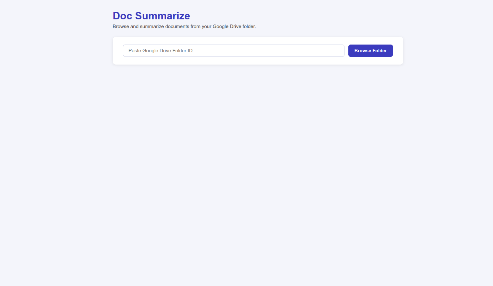
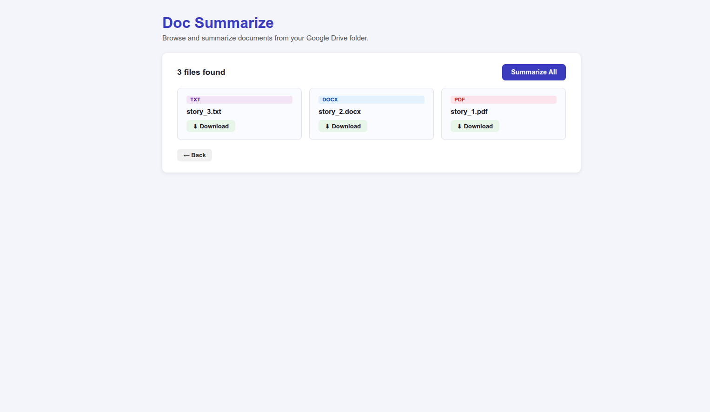
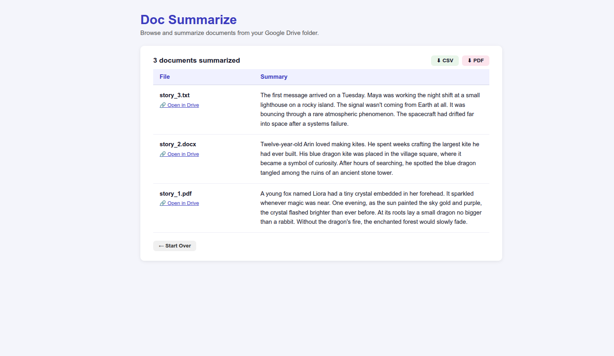

# Document Summarizer

An AI-powered web application that connects to your Google Drive folder, extracts text from documents (PDF, DOCX, TXT), and generates summaries using AI. Built with Flask, Google Drive API, and Hugging Face transformers.

---

<table>
  <tr>
    <td></td>
    <td></td>
    <td></td>
  </tr>
</table>

---

## Features

- Browse all documents in a Google Drive folder
- Download individual files directly from the browser
- Summarize all documents with one click
- Export summaries as CSV or PDF report

---

## Project Structure

```
Document_summarizer/
├── app.py
├── drive_client.py
├── parser.py
├── summarizer.py
├── requirements.txt
├── .env
├── .gitignore
└── templates/
    └── index.html
```

---

## Setup Guide

### 1. Clone the Repository

```bash
git clone https://github.com/NEEEEEEEEEEEL/Document_summarizer.git
cd Document_summarizer
```

---

### 2. Create a Virtual Environment

```bash
python3 -m venv env
source env/bin/activate
```

---

### 3. Install Dependencies

```bash
pip install -r requirements.txt
```

---

### 4. Set Up Google Drive API

#### 4.1 Create a Google Cloud Project

1. Go to [console.cloud.google.com](https://console.cloud.google.com)
2. Click the project dropdown at the top → **New Project**
3. Give it a name like `doc-summarizer` → click **Create**

#### 4.2 Enable Google Drive API

1. In the left sidebar go to **APIs & Services → Library**
2. Search for **Google Drive API**
3. Click it → click **Enable**

#### 4.3 Create OAuth Credentials

1. Go to **APIs & Services → Credentials**
2. Click **Create Credentials → OAuth 2.0 Client ID**
3. If prompted to configure consent screen, click **Configure Consent Screen**:
   - Choose **External** → click **Create**
   - Fill in **App name** (e.g. `doc-summarizer`)
   - Fill in **User support email** (your email)
   - Scroll down, fill in **Developer contact email** (your email)
   - Click **Save and Continue** through all steps
4. Back on Credentials page, click **Create Credentials → OAuth 2.0 Client ID** again
5. Choose **Desktop app** as application type
6. Click **Create**
7. Click **Download JSON**
8. Rename the downloaded file to `credentials.json`
9. Move it to your project folder:

```bash
mv ~/Downloads/client_secret_*.json ~/Desktop/Document_summarizer/credentials.json
```

#### 4.4 Add Yourself as a Test User

1. Go to **APIs & Services → OAuth Consent Screen**
2. Scroll down to **Test Users** section
3. Click **Add Users**
4. Enter your Gmail address
5. Click **Save**

---

### 5. Set Up Hugging Face Token

#### 5.1 Create a Hugging Face Account

1. Go to [huggingface.co](https://huggingface.co) and sign up for free

#### 5.2 Generate an Access Token

1. Click your profile photo → **Settings**
2. Click **Access Tokens** in the left sidebar
3. Click **New Token**
4. Give it a name like `doc-summarizer`
5. Select **Role: Read**
6. Click **Generate a token**
7. Copy the token — it starts with `hf_...`

---

### 6. Create the .env File

Create a `.env` file in the project root:

```bash
nano .env
```

Add these lines:

```
HF_TOKEN=hf_xxxxxxxxxxxxxxxxxxxxxxxx
FLASK_SECRET_KEY=any-random-string-you-choose
```

Save with `Ctrl+O` then `Ctrl+X`.

Then set the Hugging Face token in your terminal session:

```bash
export HF_TOKEN=hf_xxxxxxxxxxxxxxxxxxxxxxxx
```

---

### 7. Run the Application

```bash
cd ~/Desktop/Document_summarizer
source env/bin/activate
python3 app.py
```

Open your browser and go to:

```
http://localhost:5000
```

---

## How to Use

**Step 1 — Get your Google Drive Folder ID**

Open Google Drive, navigate to your folder, and copy the ID from the URL:

```
https://drive.google.com/drive/folders/THIS_IS_YOUR_FOLDER_ID
```

**Step 2 — First Run (Google Authorization)**

On first run, a browser window will open asking you to authorize Google Drive access:

- Select your Google account
- If you see "Google hasn't verified this app" → click **Advanced → Go to doc-summarizer (unsafe)**
- Click **Allow**

This saves a `token.json` file locally — you won't be asked again.

**Step 3 — Browse Your Folder**

Paste the folder ID and click **Browse Folder**. You will see all PDF, DOCX, and TXT files with individual download buttons.

**Step 4 — Summarize**

Click **Summarize All**. The first run downloads the AI model which takes a few minutes. After that it is cached locally and starts instantly.

**Step 5 — Export**

Download all summaries as a **CSV** or **PDF** report using the buttons on the results page.

---
